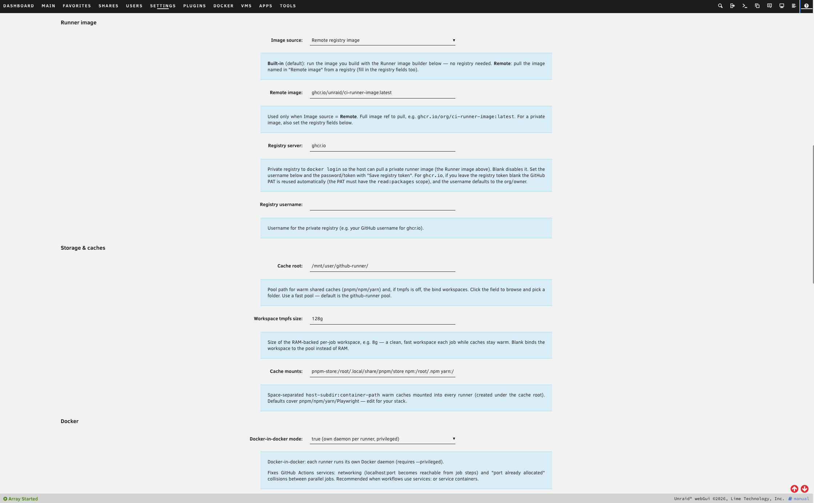
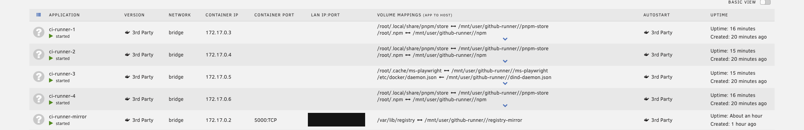

# CI Runner Farm for Unraid

Turn your Unraid server into a fleet of **GitHub Actions self-hosted runners** —
multiple concurrent, resource-capped runners running as Docker containers, with
warm shared caches, queue-aware autoscaling, and Docker-in-Docker. No VM
required.

Hosted CI minutes are slow and metered. Meanwhile, the Unraid server in your
rack has spare cores and a fast cache pool sitting idle between media tasks.
Point CI Runner Farm at a repo or organization, paste a token, and your builds
run on your own hardware — as many in parallel as your box can handle, with
dependency caches that stay hot between runs, at zero cost per minute.

---

## Why run your own CI?

- **Cost.** Hosted CI bills by the minute. A server you already own runs builds
  for the price of the electricity.
- **Speed.** Run many jobs in parallel and keep pnpm/npm/yarn/Playwright caches
  warm on a local NVMe pool — no re-downloading the world on every run.
- **It's the Unraid thing to do.** Self-hosted runners are just Docker
  containers, and Docker is what your server is already great at. This is "do
  more with the hardware you have," turned up to a build farm.
- **A couple of clicks to install.** It's a normal plugin from Community
  Applications, configured entirely from the webGUI.

---

## What you get

| Capability | What it means |
|---|---|
| **N concurrent runners** | Each runner is its own container, optionally capped with `--cpus` / `--memory` so CI never starves the rest of the host. |
| **Queue-aware autoscaling** | An optional daemon floats the fleet between a min and max based on how many jobs are waiting — capacity when you need it, idle when you don't. |
| **Warm shared caches** | pnpm / npm / yarn / Playwright caches (fully configurable) live on a fast pool and are reused across every run. This is the biggest hidden speed win over hosted CI. |
| **Docker-in-Docker per runner** | Jobs that use `services:` or `docker compose` just work, with an optional shared pull-through registry mirror so images are pulled once for the whole fleet. |
| **Bring your own image** | Use the in-plugin image builder, or point at any image you publish to a registry (public or private). |
| **One webGUI page** | Configure everything, store your token securely, Start/Stop/Restart/Scale, watch live status, and build your runner image — no shell required. |

---

## How it works

The plugin provisions a set of Docker containers from a runner image — built
in-plugin or pulled from a registry. Each container registers itself with GitHub
as a self-hosted runner, either at **repo** scope or **org** scope (org scope
gives you one shared pool that any of your private repos can pull from).

Persistent package caches and the build workspace are bind-mounted from a fast
pool so they survive across jobs. An optional companion container runs a
**pull-through registry mirror**, so Docker-in-Docker jobs across the whole fleet
pull each image only once. And an optional autoscaler watches the GitHub job
queue, scaling the fleet up toward your max when work is waiting and back down to
your min when things go quiet.

---

## Install

### Community Applications (recommended)

Search for **CI Runner Farm** in [Community Applications](https://unraid.net/community/apps)
and click **Install**.

### Install by URL

In the Unraid webGUI go to **Plugins → Install Plugin** and paste:

```
https://github.com/unraid/ci-runner-farm/releases/latest/download/ci-runner-farm.plg
```

Unraid always resolves this to the newest published release, and its built-in
"check for updates" keeps the plugin current.

---

## Setup, step by step

You'll need a GitHub Personal Access Token and a fast pool/share for caches.
Everything below happens on one page: **Settings → Utilities → CI Runner Farm**.

### 1. Point it at GitHub and size the fleet

Choose your **scope** (`repo` or `org`), set the **owner** and target repos, an
optional **runner group**, and how many **concurrent runners** to run. Add
**runner labels** (so workflows can target this fleet with `runs-on:`) and
optional **CPU / memory caps per runner** so CI can't starve the rest of the box.


### 2. Choose a runner image, caches, and Docker mode

The **Image source** selector decides where each runner's image comes from:

- **Built-in** (default) — run the image built by the in-plugin **Runner image
  builder**, tagged `ci-runner-farm-runner:latest`. The plugin ships a generic
  starter [`default.Dockerfile`](src/usr/local/emhttp/plugins/ci-runner-farm/default.Dockerfile)
  (stock runner base + a Docker-in-Docker readiness wrapper); customize it — add
  language runtimes, browsers, build tools — then **Build** and restart. No
  registry needed.
- **Remote** — pull a named image, e.g. `ghcr.io/org/ci-runner-image:latest`.
  For a private image, set the registry server and username and save a registry
  token; the host runs `docker login` before provisioning. For `ghcr.io`,
  leaving the registry token blank reuses your GitHub token (it just needs
  `read:packages`).

Below that, configure the **warm caches** (host-subdir → container-path mounts;
defaults cover pnpm/npm/yarn/Playwright), the **workspace root**, and the
**Docker-in-Docker mode**.



### 3. (Optional) Turn on queue-aware autoscaling

Set a **min** and **max** runner count, a **warm idle buffer**, an **autoscale
step**, a **demand check interval**, and a **scale-down grace** period. The
daemon adds runners when jobs are queued and removes idle ones once the grace
window passes — so you keep capacity ready without leaving the whole fleet
running around the clock.


### 4. Save your token, validate, and start the fleet

Save a GitHub **Personal Access Token** (`repo` scope; add `admin:org` for org
runners). It's stored at `/boot/config/plugins/ci-runner-farm/token` with
`chmod 600` and is **never** written into your plugin config. Click **Validate**
(no token needed) to confirm the host can provision, then use the fleet
controls — **Start / Stop / Restart / Scale** — and watch live per-runner status
(state, phase, CPU, memory). The **Runner image builder** panel lets you edit
the Dockerfile and rebuild right from the page.


### 5. Confirm it's running

Once started, the runners show up as ordinary Docker containers
(`ci-runner-1…N`), plus the optional `ci-runner-mirror` registry mirror — each
with the warm-cache bind mounts you configured. Your runners register with
GitHub and start picking up jobs.



---

## Security

Self-hosted runners execute arbitrary workflow code on your hardware. Read this
before exposing the fleet:

- DinD runners run `--privileged`, and the shared-socket mode gives runners
  root-equivalent access to the host. Use self-hosted runners **only for
  trusted/private repositories**. Fork-PR code from public repos must **never**
  run on a privileged or socket-mounted self-hosted runner.
- **The plugin actively warns you.** When you Start the fleet (and live on the
  settings page), it checks each repo-scope target's visibility via your token
  and shows a prominent warning if any is **public** while runners are
  privileged. It warns rather than blocks — the call stays yours.
- **`Share host docker.sock` now defaults to off.** Turn it on only for trusted
  private repos; DinD (the default) already covers `services:` without it.
- **Your GitHub token never enters a runner container.** The PAT stays on the
  host; each runner is handed only a short-lived registration token, and runners
  are deregistered host-side. So a workflow step can't read your token out of its
  own environment.
- For stronger isolation, set `EPHEMERAL=true` so each job gets a clean runner.
- At org scope, create a **runner group restricted to your private repos** so a
  public repo can never schedule onto these runners.

See GitHub's [self-hosted runner security guidance](https://docs.github.com/en/actions/hosting-your-own-runners/managing-self-hosted-runners/about-self-hosted-runners#self-hosted-runner-security)
for the full picture.

---

## CLI

Everything in the UI maps to the control script:

```
include/runner-farm.sh {start|boot-autostart|stop|restart|scale N|status|status-json|logs i|validate|build-image|prune-cache|autoscale-*}
```

---

## Releases & versioning

Releases are automated with
[release-please](https://github.com/googleapis/release-please) and published as
**GitHub Release assets** — the same flow used by Unraid's other plugins.

- `.release-please-manifest.json` is the SemVer source of truth; `VERSION`
  mirrors it for tooling.
- Merging [Conventional Commits](https://www.conventionalcommits.org) to `main`
  opens a release PR. That PR regenerates the self-contained
  `ci-runner-farm.plg` (version entities + embedded payload) and updates
  `CHANGELOG.md`.
- Merging the release PR tags `vX.Y.Z`, cuts a GitHub Release, validates the
  tagged `.plg`, and uploads it as the `ci-runner-farm.plg` release asset that
  the install URL above resolves to.

The Unraid plugin-manager `<version>` is written as
`YYYY.MM.DD.HHMM.BUILD-INTERNAL` (e.g. `2026.06.24.1530.42-0.1.0`) so it sorts
chronologically in the plugin manager while still pinning the SemVer release.

---

## Development

```sh
./build-plg.sh                 # build ci-runner-farm.plg from src/ (date-stamped dev build)
./deploy.sh root@tower         # rsync src/ to a dev Unraid host (fast iteration; not for installs)
```

The `.plg` is fully self-contained: the plugin file tree is tarred,
base64-encoded, and embedded inline, so installing only ever fetches the single
`.plg` — no external file hosting.

### Layout

```
ci-runner-farm.plg                 self-contained installer (built artifact, committed)
build-plg.sh                       packages src/ -> versioned .plg
deploy.sh                          dev-only raw deploy to an Unraid host
release-please-config.json         release-please configuration
.release-please-manifest.json      SemVer source of truth
VERSION                            mirror of the internal SemVer version
src/usr/local/emhttp/plugins/ci-runner-farm/
  RunnerFarm.page                  Settings page (Dynamix)
  default.cfg                      seed config
  default.Dockerfile               generic starter runner image
  include/runner-farm.sh           provisioning/control script
  include/exec.php                 CSRF-guarded web endpoint
.github/workflows/
  package-plugins.yml              PR/branch build + validate
  release-please.yml               release automation + asset upload
  release.yml                      tagged-release validation
```

---

## Support

Questions and bug reports: <https://github.com/unraid/ci-runner-farm/issues>
