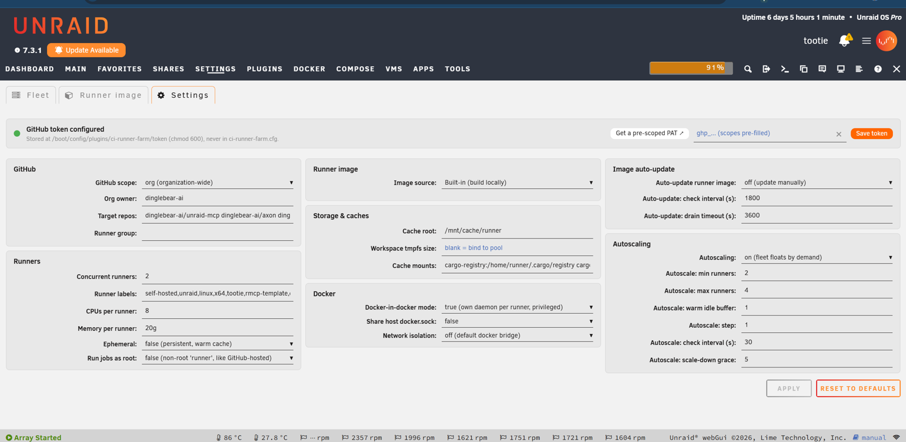
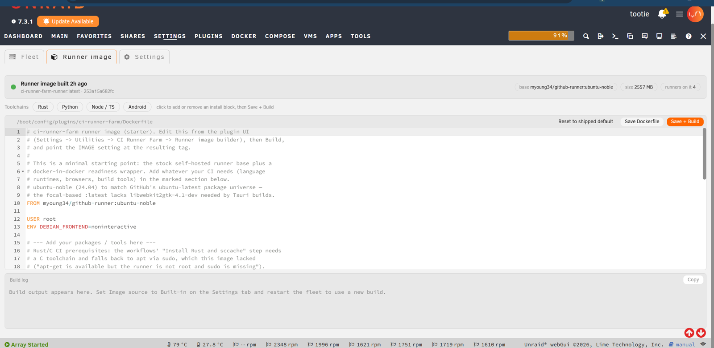
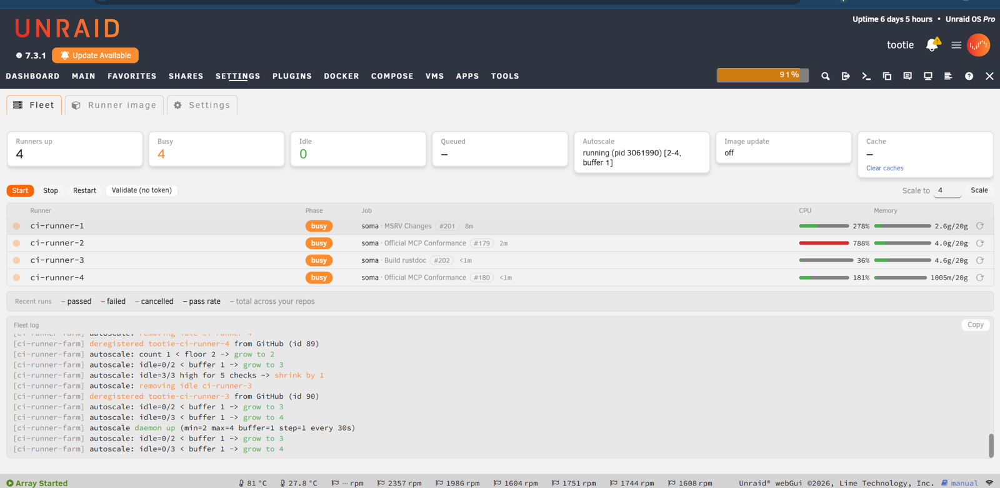
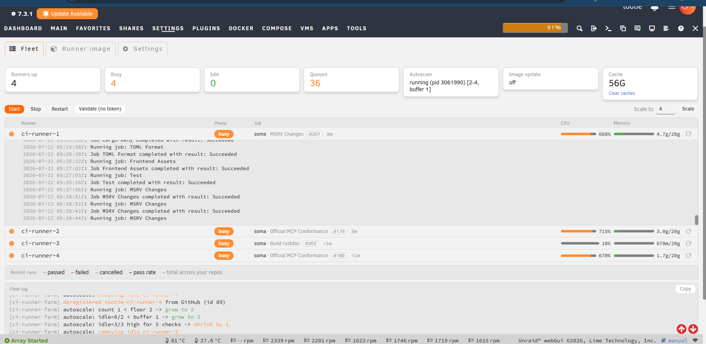

# CI Runner Farm for Unraid

Turn your Unraid server into a fleet of **GitHub Actions self-hosted runners** —
multiple concurrent, resource-capped runners running as Docker containers, with
warm shared caches, queue-aware autoscaling, and Docker-in-Docker. No VM
required.

Hosted CI minutes are slow and metered. Meanwhile, the Unraid server in your
rack has spare cores and a fast cache pool sitting idle between media tasks.
Point CI Runner Farm at a repo or organization, paste a token, and your builds
run on your own hardware — as many in parallel as your box can handle, with
dependency caches that stay hot between runs, at zero cost per minute.

---

## Why run your own CI?

- **Cost.** Hosted CI bills by the minute. A server you already own runs builds
  for the price of the electricity.
- **Speed.** Run many jobs in parallel and keep pnpm/npm/yarn/Playwright caches
  warm on a local NVMe pool — no re-downloading the world on every run.
- **It's the Unraid thing to do.** Self-hosted runners are just Docker
  containers, and Docker is what your server is already great at. This is "do
  more with the hardware you have," turned up to a build farm.
- **A couple of clicks to install.** It's a normal plugin from Community
  Applications, configured entirely from the webGUI.

---

## What you get

| Capability | What it means |
|---|---|
| **N concurrent runners** | Each runner is its own container, optionally capped with `--cpus` / `--memory` so CI never starves the rest of the host. |
| **Queue-aware autoscaling** | An optional daemon floats the fleet between a min and max based on how many jobs are waiting — capacity when you need it, idle when you don't. |
| **Warm shared caches** | Rust/cargo, npm, yarn, pnpm, and Playwright caches (fully configurable) live on a fast pool and are reused across every run. This is the biggest hidden speed win over hosted CI. |
| **Docker-in-Docker per runner** | Jobs that use `services:` or `docker compose` just work, with an optional shared pull-through registry mirror so images are pulled once for the whole fleet. |
| **Bring your own image** | Point at any image you publish to a registry, or build one in-plugin — toggle **Rust / Python / Node·TS / Android** toolchains into the Dockerfile with one click, then Build. |
| **Live fleet dashboard** | Watch each runner's phase, the repo and **PR # it's building right now**, and live CPU/memory against its cap — plus queue depth, cache usage (one-click clear), recent-run pass rates, per-runner log drawers, and a colorized activity log. |
| **One webGUI page** | Three tabs — configure, build your image, run and watch the fleet — with your token stored securely on the host. No shell required. |

---

## How it works

The plugin provisions a set of Docker containers from a runner image — built
in-plugin or pulled from a registry. Each container registers itself with GitHub
as a self-hosted runner, either at **repo** scope or **org** scope (org scope
gives you one shared pool that any of your private repos can pull from).

Persistent package caches and the build workspace are bind-mounted from a fast
pool so they survive across jobs. An optional companion container runs a
**pull-through registry mirror**, so Docker-in-Docker jobs across the whole fleet
pull each image only once. And an optional autoscaler watches the GitHub job
queue, scaling the fleet up toward your max when work is waiting and back down to
your min when things go quiet.

---

## Install

### Community Applications (recommended)

Search for **CI Runner Farm** in [Community Applications](https://unraid.net/community/apps)
and click **Install**.

### Install by URL

In the Unraid webGUI go to **Plugins → Install Plugin** and paste:

```
https://github.com/unraid/ci-runner-farm/releases/latest/download/ci-runner-farm.plg
```

Unraid always resolves this to the newest published release, and its built-in
"check for updates" keeps the plugin current.

---

## Setup, step by step

Everything lives on one page — **Settings → Utilities → CI Runner Farm** — split
into three tabs: **Settings** (configure), **Runner image** (build), and
**Fleet** (run and watch). You'll need a GitHub Personal Access Token and a fast
pool/share for caches.

### 1. Configure the fleet — the *Settings* tab

The Settings tab holds the whole configuration on one screen:

- **GitHub** — pick your **scope** (`repo` or `org`), the **owner** and **target
  repos**, and an optional **runner group**.
- **Runners** — how many **concurrent runners**, their **labels** (so workflows
  target this fleet with `runs-on:`), and optional **CPU / memory caps per
  runner** so CI can't starve the rest of the box.
- **Runner image** — the **Image source**: **Built-in** (build locally, below),
  or **Remote** to pull a named image, e.g. `ghcr.io/org/ci-runner-image:latest`
  (for a private image, set the registry server/username and save a registry
  token; for `ghcr.io`, a blank registry token reuses your GitHub token).
- **Storage & caches** — the **warm caches** (host-subdir → container-path
  mounts; defaults cover cargo/npm/yarn/pnpm/Playwright) and the **workspace
  root**.
- **Docker** — **Docker-in-Docker** mode, host-socket sharing, and network
  isolation.
- **Autoscaling** and **image auto-update** — optional; see steps below.

Save your **Personal Access Token** from the band at the top (`repo` scope; add
`admin:org` for org runners). It's stored at
`/boot/config/plugins/ci-runner-farm/token` with `chmod 600` and is **never**
written into your plugin config — the **Get a pre-scoped PAT** link opens GitHub
with exactly the right scopes pre-filled.



### 2. Build a runner image — the *Runner image* tab

Point CI at any registry image, or build one right here. The Runner image tab is
a syntax-highlighted, in-page Dockerfile editor over a generic
[starter image](src/usr/local/emhttp/plugins/ci-runner-farm/default.Dockerfile)
(stock self-hosted runner base + a Docker-in-Docker readiness wrapper). Click the
**toolchain** pills — **Rust**, **Python**, **Node / TS**, **Android** — to
splice matching install blocks in or out, then **Save + Build** and watch the
live build log. Restart the fleet to roll onto the new image. No registry needed.



### 3. Run and watch — the *Fleet* tab

The Fleet tab is mission control. **Validate** (no token needed) confirms the
host can provision, then **Start / Stop / Restart / Scale** the fleet and watch
live per-runner status: phase, the **repo and PR # each runner is building right
now** (linked to the GitHub run), and live **CPU / memory** against each runner's
cap. Click the ↻ on a runner to **recycle** it — deregister, remove, and bring
back a fresh replacement in place, so the fleet keeps its size.

The stat tiles track runners up / busy / idle, GitHub **queue** depth, autoscaler
state, image-update state, and total **cache** usage — with a one-click **Clear
caches**. A **Recent runs** strip summarizes pass/fail/cancel rates across your
repos, and the colorized **Fleet log** streams autoscaler and action output.



Click any runner to drop down a live **log drawer** streaming that container's
job output inline:



### 4. (Optional) Queue-aware autoscaling

On the Settings tab, set a **min** and **max** runner count, a **warm idle
buffer**, an **autoscale step**, a **demand check interval**, and a **scale-down
grace** period. The daemon adds runners when jobs are queued and removes idle
ones once the grace window passes — so you keep capacity ready without leaving
the whole fleet running around the clock. Its decisions stream into the Fleet
log.

Once started, the runners also show up as ordinary Docker containers
(`ci-runner-1…N`), plus the optional `ci-runner-mirror` registry mirror — each
with the warm-cache bind mounts you configured — register with GitHub, and start
picking up jobs.

---

## Security

Self-hosted runners execute arbitrary workflow code on your hardware. Read this
before exposing the fleet:

- DinD runners run `--privileged`, and the shared-socket mode gives runners
  root-equivalent access to the host. Use self-hosted runners **only for
  trusted/private repositories**. Fork-PR code from public repos must **never**
  run on a privileged or socket-mounted self-hosted runner.
- **The plugin actively warns you.** When you Start the fleet (and live on the
  settings page), it checks each repo-scope target's visibility via your token
  and shows a prominent warning if any is **public** while runners are
  privileged. It warns rather than blocks — the call stays yours.
- **`Share host docker.sock` now defaults to off.** Turn it on only for trusted
  private repos; DinD (the default) already covers `services:` without it.
- **Your GitHub token never enters a runner container.** The PAT stays on the
  host; each runner is handed only a short-lived registration token, and runners
  are deregistered host-side. So a workflow step can't read your token out of its
  own environment.
- **Network isolation** (Docker section) confines runners at the network layer:
  - `isolate` puts them on a dedicated bridge so they can't reach your **other
    Unraid containers**;
  - `strict` adds firewall rules (Docker's `DOCKER-USER` chain) that also block
    the runners from the **Unraid host and your LAN**, while still allowing the
    internet and the shared image cache. Recommended if runners might touch
    less-trusted code. Applies on the next Start; needs `iptables` on the host.
- For stronger isolation, set `EPHEMERAL=true` so each job gets a clean runner.
- At org scope, create a **runner group restricted to your private repos** so a
  public repo can never schedule onto these runners.

See GitHub's [self-hosted runner security guidance](https://docs.github.com/en/actions/hosting-your-own-runners/managing-self-hosted-runners/about-self-hosted-runners#self-hosted-runner-security)
for the full picture.

---

## CLI

Everything in the UI maps to the control script:

```
include/runner-farm.sh {start|boot-autostart|stop|restart|scale N|status|status-json|logs i|validate|build-image|prune-cache|autoscale-*}
```

---

## Releases & versioning

Releases are automated with
[release-please](https://github.com/googleapis/release-please) and published as
**GitHub Release assets** — the same flow used by Unraid's other plugins.

- `.release-please-manifest.json` is the SemVer source of truth; `VERSION`
  mirrors it for tooling.
- Merging [Conventional Commits](https://www.conventionalcommits.org) to `main`
  opens a release PR. That PR regenerates the self-contained
  `ci-runner-farm.plg` (version entities + embedded payload) and updates
  `CHANGELOG.md`.
- Merging the release PR tags `vX.Y.Z`, cuts a GitHub Release, validates the
  tagged `.plg`, and uploads it as the `ci-runner-farm.plg` release asset that
  the install URL above resolves to.

The Unraid plugin-manager `<version>` is written as
`YYYY.MM.DD.HHMM.BUILD-INTERNAL` (e.g. `2026.06.24.1530.42-0.1.0`) so it sorts
chronologically in the plugin manager while still pinning the SemVer release.

---

## Development

```sh
./build-plg.sh                 # build ci-runner-farm.plg from src/ (date-stamped dev build)
./deploy.sh root@tower         # rsync src/ to a dev Unraid host (fast iteration; not for installs)
```

The `.plg` is fully self-contained: the plugin file tree is tarred,
base64-encoded, and embedded inline, so installing only ever fetches the single
`.plg` — no external file hosting.

### Layout

```
ci-runner-farm.plg                 self-contained installer (built artifact, committed)
build-plg.sh                       packages src/ -> versioned .plg
deploy.sh                          dev-only raw deploy to an Unraid host
release-please-config.json         release-please configuration
.release-please-manifest.json      SemVer source of truth
VERSION                            mirror of the internal SemVer version
src/usr/local/emhttp/plugins/ci-runner-farm/
  RunnerFarm.page                  Settings page (Dynamix)
  default.cfg                      seed config
  default.Dockerfile               generic starter runner image
  include/runner-farm.sh           provisioning/control script
  include/exec.php                 CSRF-guarded web endpoint
.github/workflows/
  package-plugins.yml              PR/branch build + validate
  release-please.yml               release automation + asset upload
  release.yml                      tagged-release validation
```

---

## Support

Questions and bug reports: <https://github.com/unraid/ci-runner-farm/issues>
