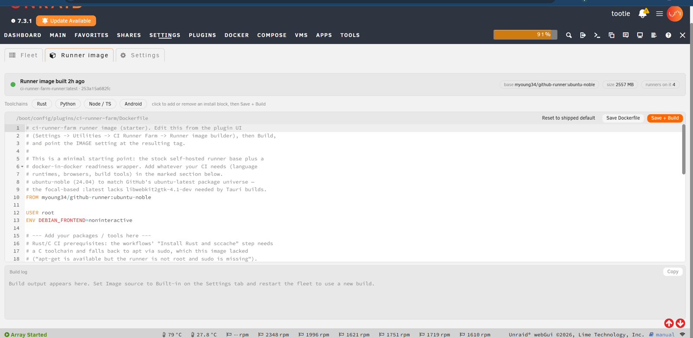

# CI Runner Farm for Unraid

Turn an Unraid server into a resource-capped fleet of self-hosted runners for
**GitHub Actions or GitLab CI/CD**. The farm keeps package and image caches warm,
supports Docker-in-Docker, and can scale several single-job runner slots without
requiring a VM.

GitHub remains the default provider, so an existing installation upgrades
without changing its runner behavior. A farm runs one provider at a time;
switching provider drains and recreates the managed slots with the selected
provider's credentials and runtime.

## What you get

| Capability | What it means |
| --- | --- |
| Concurrent runner slots | Each slot accepts one job at a time and can have CPU and memory limits, keeping CI from starving the rest of the host. |
| GitHub and GitLab providers | Keep the existing GitHub Actions integration or select GitLab.com/self-managed GitLab. |
| Warm shared caches | Reuse npm, yarn, pnpm, Playwright, Cargo, sccache, or custom cache directories across jobs. |
| Slot-scoped Docker-in-Docker | Give each runner slot a private privileged Docker daemon without exposing Unraid's existing Docker socket by default; privileged DinD is still capable of host compromise. |
| Bring your own job image | Pull a remote image or edit and build a provider-specific starter image in the plugin. |
| Named runner pools | Route jobs to purpose-built pools with independent fixed capacity, labels/tags, CPU, memory, and images. |
| Fleet controls and telemetry | Validate, start, stop, scale, recycle, and inspect runner/job state from the Unraid webGUI. |
| Optional autoscaling | Keep a warm idle buffer between configured minimum and maximum runner counts. |

## Architecture

GitHub mode preserves the original container model: each `ci-runner-N`
container is a GitHub Actions runner based on the configured runner image. The
host keeps the GitHub PAT and gives containers only short-lived registration
tokens.

GitLab mode uses the official
[`gitlab/gitlab-runner`](https://docs.gitlab.com/runner/install/docker/) image;
it does not modify or fork GitLab Runner itself. Each slot contains:

- `ci-runner-N`, a persistent GitLab Runner manager with `concurrent = 1`, a
  per-runner `limit = 1`, and a persisted `config.toml` plus
  `.runner_system_id`;
- `ci-runner-N-dind`, by default, a private privileged Docker daemon shared
  with that manager through a Unix socket; and
- one temporary Docker-executor job container for each accepted pipeline job,
  created from the configured default job image or the job's `.gitlab-ci.yml`
  `image:` override.

The reusable GitLab `glrt-` token identifies the runner configuration. Each
manager retains its own system ID, so recycling a slot does not create a new
shared runner configuration in GitLab.

## Named pools and per-pool images

Set **Runner layout** to **Named pools** when one host should offer different
runner capabilities, for example a normal build pool and a QA-VM client pool.
Each pool record declares a stable pool ID, routing label, additional labels,
fixed capacity, resource limits, and either the built-in image or a registry
image. Containers are named `ci-runner-<pool>-<index>` and carry the pool as a
provider-neutral ownership label.

GitHub pools require organization scope. Their routing and additional labels
are passed to the GitHub runner directly. GitLab pools require a separate
runner configuration and modern `glrt-` authentication token per pool; create
that runner in GitLab with tags matching the pool's labels, then save the token
with the pool ID in Settings. This keeps GitLab's server-owned tag routing
authoritative instead of pretending local `config.toml` can change it.

The V3 record format is:

```text
v3|id|routing-label|additional-labels|fixed|min|max|idle|cpus|memory|image
```

Records are separated by semicolons. `cpus` and `memory` may be `inherit`;
`image` may be `builtin` or a full registry reference. The current classic-pool
implementation uses `fixed` capacity and deliberately rejects global autoscale
and global image auto-update in pool mode. `min`, `max`, and `idle` are retained
in the versioned contract so adding per-pool autoscaling later does not require
reformatting every pool. Saving pool changes does not interrupt jobs; use Fleet
**Restart** when ready to apply exact membership, images, and limits.

## Install

### Community Applications

Search for **CI Runner Farm** in
[Community Applications](https://unraid.net/community/apps) and click
**Install**.

### Install by URL

In **Plugins → Install Plugin**, paste:

```text
https://github.com/unraid/ci-runner-farm/releases/latest/download/ci-runner-farm.plg
```

Everything is managed from **Settings → Utilities → CI Runner Farm**. The page
has **Fleet**, **Runner image**, and **Settings** tabs.

## GitHub setup

1. Leave **Active provider** set to **GitHub Actions**.
2. Select repository or organization scope, then configure the owner, target
   repositories, optional runner group, labels, and resource limits.
3. Create and save a classic GitHub Personal Access Token.
4. Configure Docker, caches, job image, and optional autoscaling; then
   **Validate** and **Start** on the Fleet tab.

| Use case | Classic PAT scopes |
| --- | --- |
| Repository runners | `repo` |
| Organization runners | `repo`, `admin:org` |
| Either runner type with a private GHCR image | Add `read:packages` |
| Separate registry token for a private GHCR image | `read:packages` |

The GitHub PAT is stored at
`/boot/config/plugins/ci-runner-farm/token` with mode `0600`; it is not written
to the main config or passed into job containers. Existing GitHub settings,
container names, and the legacy editable `Dockerfile` remain compatible.

## GitLab setup

### 1. Create the runner in GitLab

Create a project, group, or instance runner using GitLab's
[new runner creation workflow](https://docs.gitlab.com/ci/runners/new_creation_workflow/).
Set its tags, protected status, project/group scope, and whether it may run
untagged jobs in GitLab. Copy the runner authentication token shown after
creation; the token must begin exactly with `glrt-`.

The same token is intentionally reused by the farm's manager slots. Avoid
automatic authentication-token rotation for this shared multi-manager setup:
one manager can rotate first and leave the other persisted managers with the
old token. Rotate manually by stopping the farm, replacing the saved token, and
starting it again. Slot retirement uses the token plus that slot's persisted
system ID to delete only its runner-manager record; it never deletes the shared
runner entity. The plugin rejects `glrtr-` tokens created through the deprecated
registration-token workflow because their unregister semantics can delete that
shared runner. It also rejects instance-prefixed variants: current official
GitLab Runner releases recognize the safe manager-only unregister path only when
the token itself starts with `glrt-`.

### 2. Configure the provider

On the Settings tab:

1. Set **Active provider** to **GitLab CI/CD**.
2. Set **GitLab URL** to `https://gitlab.com` or the HTTPS base URL of a
   self-managed instance.
3. Keep the official manager image or pin a version appropriate for the
   self-managed instance, for example `gitlab/gitlab-runner:v18.5.0`. Explicit
   host-socket mode requires Runner 18.5.0 or newer; Start and Validate reject an
   older or unparseable version because safe host cleanup depends on the exact
   build/helper/service labels fixed in that release. Every mode requires
   Runner 16.0.0 or newer because that release added manager-only unregister
   with a persisted system ID. Older images are rejected rather than risk
   deleting the shared runner entity. Use GitLab 16.0 or newer for a self-managed
   server so its runner-authentication-token and manager-system-ID APIs match
   this lifecycle contract.
4. Save the required `glrt-` runner token.
5. Set the graceful manager shutdown timeout. The default is 7200 seconds.
6. Optionally enter monitored project paths and save a separate access token
   with `read_api`. A project access token covers only its project; for several
   monitored projects use a group token scoped to their common group or a
   dedicated PAT that can read every listed project.
7. Configure resource limits, caches, the default job image, Docker mode, and
   optional image/service execution policy; save, **Validate**, and **Start**.

The runner token is stored separately as
`/boot/config/plugins/ci-runner-farm/gitlab-runner-token`. The optional API
token is stored as `gitlab-api-token`. Core job execution needs only the runner
token; the API token is used exclusively for advisory queue and recent-job
telemetry. GitLab Runner also requires the reusable runner token in each
mode-`0600` per-slot `gitlab-runners/ci-runner-N/config.toml`. Token validation
uses a mode-`0600` `gitlab-token-probe/config.toml`: GitLab verification creates
a temporary manager row, so the plugin immediately unregisters it and retains
that file only when exact cleanup must be retried. After a manager is
successfully unregistered and all of its local containers are removed, ordinary
Stop, scale-down, recycle, and provider switching scrub that slot's TOML, Docker
auth, CA snapshot, and unregister marker while preserving `.runner_system_id`.
Any failed retirement preserves the complete material needed for a safe retry.
Clearing the runner token applies the same rule across the active fleet. Stop,
Restart, manager replacement, and active-token removal send `SIGQUIT`, stop
accepting new jobs, and wait up to
`GITLAB_SHUTDOWN_TIMEOUT` for an in-flight job to finish before Docker forces the
manager to stop. The Unraid `stopping_docker` hook quiesces all GitLab managers
in parallel before Docker stops their DinD sidecars, preserving the same graceful
behavior for array stops and Docker-service restarts. The plugin registers no
diagnostics collector for the
bootstrap/API/registry token files, per-slot/probe `config.toml` files, or Docker auth
files. Current Unraid system diagnostics list the plugin configuration directory
but do not copy those file contents. Do not add those paths to a support bundle
or attach them manually; they contain live credentials even though their modes
are restricted.

If GitLab is permanently unreachable or the saved manager token has been
revoked, normal Stop/Recycle intentionally fails closed and preserves the local
manager identity for retry. The Fleet row's warning action provides a separately
confirmed **force local forget** escape hatch: it interrupts that slot, deletes
its local manager/sidecar/token-bearing config and slot Docker/cache roots
without contacting GitLab, and
leaves any offline remote manager record for you to remove in GitLab manually.

### Self-managed GitLab and custom CAs

Use the complete HTTPS base URL, including a non-default port if required. If
the instance's certificate chain is not already trusted, upload its PEM CA
chain in the GitLab credential band. It is stored as
`/boot/config/plugins/ci-runner-farm/gitlab-ca.crt`. Each manager snapshots the
CA used to create it alongside that slot's `config.toml`, so a CA rotation does
not prevent the old manager identity from unregistering. The manager uses its
snapshot for the GitLab API, and the Docker executor mounts it at the official
`/etc/gitlab-runner/certs/ca.crt` helper path so clone, artifact, and cache
helpers trust it. Runner also exposes the GitLab chain to jobs through
`CI_SERVER_TLS_CA_FILE`, but an arbitrary job image does not automatically add
it to that image's system trust store. Job scripts that call the self-managed
service directly must use that file (for example, `curl --cacert
"$CI_SERVER_TLS_CA_FILE" ...`) or install it using the image's own CA tooling.

In DinD mode the uploaded CA is also installed for the exact authority in
**Registry server**, allowing that per-slot daemon to pull from a registry using
the same private CA. GitLab registry endpoints must use HTTPS (the scheme may be
omitted); plain HTTP is rejected so credentials are never sent to an insecure
registry. GitLab keeps the configured registry credentials available
to each manager even when its default job image is built locally, so an
`image:` or `services:` override can authenticate to that one registry. The
strict-network exception for the configured authority follows the same rule.
This does not discover other registry hostnames from job configuration. If the
GitLab registry uses a different hostname or CA, configure that authority and
chain explicitly. Host-socket mode cannot modify Unraid's Docker trust store;
install the registry CA on the host and restart its Docker service before using
that mode. The built-in shared Docker Hub mirror is local HTTP and is explicitly
scoped as an insecure registry inside each DinD daemon; the uploaded CA is
unrelated to it.

Strict network isolation normally blocks the host and LAN. GitLab mode adds a
narrow exception for the configured GitLab endpoint so a self-managed instance
remains reachable; do not use a broad LAN allow rule. Configure private job
image registries explicitly rather than weakening the runner network.

Each private DinD daemon also allocates per-build job and service networks from
Docker's default address pools. If a self-managed GitLab or registry lives in a
private CIDR that overlaps those pools (commonly `172.16.0.0/12`), an inner
Docker route can shadow the real endpoint even though the farm firewall allows
it. Keep CI/registry endpoints on non-overlapping subnets, or configure suitable
Docker default address pools before relying on that topology.

### Queue telemetry limitation

GitLab does not expose one public API endpoint containing every pending job
eligible for a particular runner. With a `read_api` token, the plugin can count
pending/recent jobs only for **Monitored projects** that the token can read.
That number is advisory: it can omit other eligible projects and jobs excluded
by tags or protection rules. Runner execution and busy/idle scaling do not rely
on it.

## Job images

The Runner image tab maintains provider-specific editable files on flash:

- `Dockerfile.github` for the GitHub runner container;
- `Dockerfile.gitlab` for GitLab Docker-executor job containers; and
- legacy `Dockerfile`, used as the GitHub fallback so existing customized
  installs keep working.

The packaged starter files are `default.github.Dockerfile` and
`default.gitlab.Dockerfile`; the original `default.Dockerfile` remains
byte-identical to the GitHub default for compatibility. The GitLab starter is a
general Ubuntu job image with common build tools and a Docker client. It is
deliberately not the GitLab Runner manager image. A GitLab job may override the
default with:

```yaml
build:
  image: node:24
  script:
    - npm ci
    - npm test
```

GitHub-only image controls such as `EPHEMERAL`, `RUN_AS_ROOT`, and the workspace
tmpfs do not change GitLab Docker-executor semantics. GitLab jobs are **always
ephemeral at the job-container layer**: the manager and configured caches
persist, but every accepted job receives a fresh Docker container.

### GitLab execution policy

Pipeline write access implies job-image selection and code execution on this
host. The GitLab settings therefore expose the Docker executor's
`allowed_images`, `allowed_services`, `pull_policy`, and `shm_size` controls:

- `GITLAB_ALLOWED_IMAGES` and `GITLAB_ALLOWED_SERVICES` are space-separated
  wildcard patterns. Empty values deliberately preserve the upgrade-compatible
  GitLab Runner default of allowing every image; configure explicit trusted
  registries or image families to narrow that exposure.
- `GITLAB_PULL_POLICY=auto` preserves existing behavior (`if-not-present` for
  the locally built image, `always` for a remote default). An explicit
  `always` or `if-not-present` value is also written as
  `allowed_pull_policies`, so jobs cannot select a different pull policy.
  Explicit `always` requires a remote default image; it is rejected for the
  locally built tag because Runner would try to pull a tag with no registry.
  Runner's `never` policy is rejected because a fresh per-slot daemon cannot
  obtain the helper and service images required to execute its first job.
- `GITLAB_SHM_SIZE` is an integer byte count for Docker-executor containers.
  The default `0` preserves Docker's default; browser/test workloads commonly
  need a larger value such as `1073741824` (1 GiB).

These controls follow GitLab Runner's
[Docker executor configuration](https://docs.gitlab.com/runner/configuration/advanced-configuration/#the-runnersdocker-section).
They govern images and services admitted by GitLab Runner; they are useful
guardrails against accidental or declarative `.gitlab-ci.yml` overrides, not a
security boundary. Every job, helper, and service container receives the
selected Docker socket, so its code can invoke the Docker API directly to
pull/run an otherwise disallowed image;
against privileged DinD it can also request privileged nested containers. Route
only trusted code to this farm even when allowlists are configured.
Maximum job duration is server-owned runner metadata rather than a local
`config.toml` key; set it on the runner in GitLab or with the
[Runners API](https://docs.gitlab.com/ci/runners/configure_runners/#set-the-maximum-job-timeout).



## Cache scope and concurrency

GitLab's native `/cache` bind is deliberately **per slot**
(`gitlab-cache/ci-runner-N`), so managers do not race on the same Runner cache
files; the tradeoff is that a cache warmed on one slot is not automatically
available on another. The configurable `CACHE_MOUNTS` directories are different:
they are shared across every slot for package-manager reuse. Use them only for
cache formats whose tools support concurrent writers, or assign disjoint
directories yourself. The plugin does not currently emit GitLab's distributed
S3 cache configuration, so an external MinIO/S3 backend is not yet a supported
configuration key.

## Docker and security

Self-hosted runners execute repository-controlled code on your hardware. Use
privileged or socket-mounted runners only for trusted private projects.

- **DinD is slot-scoped, not host-secure.** Each GitLab slot gets a private
  privileged daemon, and `concurrent = 1` limits its normal cross-job blast
  radius to that slot. The daemon creates the job, helper, and service
  containers, and its socket is mounted into job, helper, and service containers;
  any of them can therefore inspect or remove those siblings, pull/run images that
  bypass Runner's image/service allowlists, and request privileged containers
  inside the nested daemon. More importantly,
  the DinD sidecar itself is privileged and must be treated as capable of host
  compromise. It avoids handing jobs Unraid's existing Docker control socket,
  but it is not a security boundary against the NAS. GitLab validation rejects
  configurations with neither DinD nor host-socket sharing because the Docker
  executor would have no endpoint.
- **Host socket sharing is root-equivalent host access.** Enable it only as an
  explicit alternative for trusted jobs. A job that controls
  `/var/run/docker.sock` can control Unraid's containers and host filesystem.
  GitLab host-socket mode requires `NETWORK_ISOLATION=off`: per-build networks
  are created by Unraid's daemon and cannot be confined by attaching only the
  manager to the farm's dedicated bridge.
- **Public/fork pipelines are dangerous.** Do not route untrusted merge-request
  or pull-request code to privileged DinD or host-socket runners. Enforce
  protected runners, tags, runner groups, and private project scope at the CI
  provider.
- **Credentials are separated.** Runner-management credentials live in
  mode-`0600` host files, not `ci-runner-farm.cfg`. Registry credentials use the
  separate `registry-token` file. Clearing it unlinks every per-slot auth file
  and the plugin-owned tmpfs Docker client config immediately; the plugin never
  logs registry credentials into root's global Docker config. Managers mount the
  containing per-slot directory and observe removal. An image pull that already
  authenticated may still finish.
- **Network isolation matters.** `isolate` separates runner containers from
  other Unraid containers. `strict` also blocks the Unraid host and LAN, apart
  from narrowly configured service endpoints.

GitHub runner containers resolve `runner-farm.host` to the management address
of the Unraid host that launched them. Use this stable alias for a service that
is deliberately colocated with a runner pool. `host.docker.internal` remains
the Docker bridge gateway for local Docker services. In `strict` mode, only TCP
port 22 on the exact `runner-farm.host` address is allowed for the colocated QA
VM MCP transport; other host and LAN access remains blocked.

See [GitHub's self-hosted runner security guidance](https://docs.github.com/en/actions/hosting-your-own-runners/managing-self-hosted-runners/about-self-hosted-runners#self-hosted-runner-security)
and [GitLab's self-managed runner security guidance](https://docs.gitlab.com/runner/security/).

## Fleet and autoscaling

The Fleet tab shows provider-neutral runner, project, job, ref, CPU, and memory
state while retaining GitHub run/PR links for compatibility. Runner-manager logs
are available from each slot; job links open in the provider UI. The autoscaler
maintains the configured minimum, maximum, and warm-idle buffer and drains busy
slots before recycling or switching provider. Autoscaling is off by default and
must be explicitly enabled for GitLab; when enabled, it uses observed manager
metrics and job containers, never the incomplete advisory project queue. A
provider switch is an idle-drained rolling transition: a busy old-provider slot
finishes first, its old adapter deregisters it, and only then is that slot
recreated for the new provider.
The Fleet tab may therefore briefly show both providers during the transition;
ordinary steady state still has one active provider.


## CLI

```text
include/runner-farm.sh {start|boot-autostart|docker-stopping|stop|restart|scale N|status|status-json|logs i|validate|build-image|prune-cache|autoscale-*}
```

## Development

Fork the repository on GitHub, then keep the canonical project as `upstream`:

```sh
git clone git@github.com:YOUR-ACCOUNT/ci-runner-farm.git
cd ci-runner-farm
git remote add upstream https://github.com/unraid/ci-runner-farm.git
git switch -c feat/gitlab-provider
```

Run all checks in the bundled Linux environment. This is the preferred command
on macOS because the host commonly has Bash 3, BSD tar/realpath, and no PHP CLI:

```sh
./tests/run-linux-checks.sh
```

With compatible Linux tools installed, run `bash tests/check.sh` directly.
Checks cover Bash/PHP syntax, config parity, safe cache paths, the provider and
credential contract, fork release guards, generated XML, and exact package
contents.

Build and deploy to a disposable Unraid development host:

```sh
./build-plg.sh
./deploy.sh root@tower
```

`deploy.sh` uploads the complete runtime into a staging directory, validates
its sentinels and permissions, then performs a rollback-protected replacement
of the development copy.
Stop the fleet before deploying; the script refuses an active fleet/daemon so
long-running processes cannot keep executing an unlinked older engine while
new web actions use the replacement.
The generated `.plg` downloads a version-pinned reproducible `.tgz`; it is not
an inline/base64 package.

### Layout

```text
ci-runner-farm.plg                  generated installer metadata
build-plg.sh                        packages src/ into .plg + reproducible .tgz
deploy.sh                           complete-tree atomic dev deployment
tests/check.sh                      Linux/CI check entry point
tests/run-linux-checks.sh           containerized local check entry point
src/usr/local/emhttp/plugins/ci-runner-farm/
  default.Dockerfile                legacy GitHub starter (compatibility)
  default.github.Dockerfile         named GitHub runner starter
  default.gitlab.Dockerfile         GitLab Docker-executor job starter
  default.cfg                       public reference defaults
  include/runner-farm.sh            common lifecycle engine
  include/providers/                provider adapters
  include/exec.php                  CSRF-guarded web endpoint
```

The release workflows are guarded to `unraid/ci-runner-farm`. They remain inert
in forks even when a fork pushes `main`, tags `v*`, or dispatches them manually.
The fork's CI stays on GitHub; no `.gitlab-ci.yml` is required to add GitLab as a
runtime provider.

## Releases and support

Canonical releases use release-please and GitHub Release assets. Questions and
bug reports: <https://github.com/unraid/ci-runner-farm/issues>
