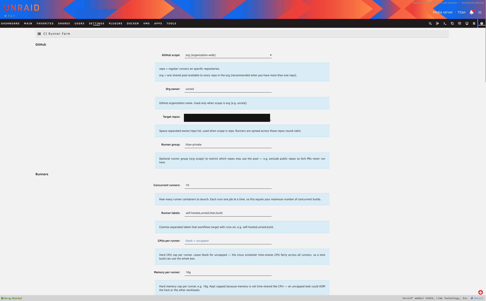
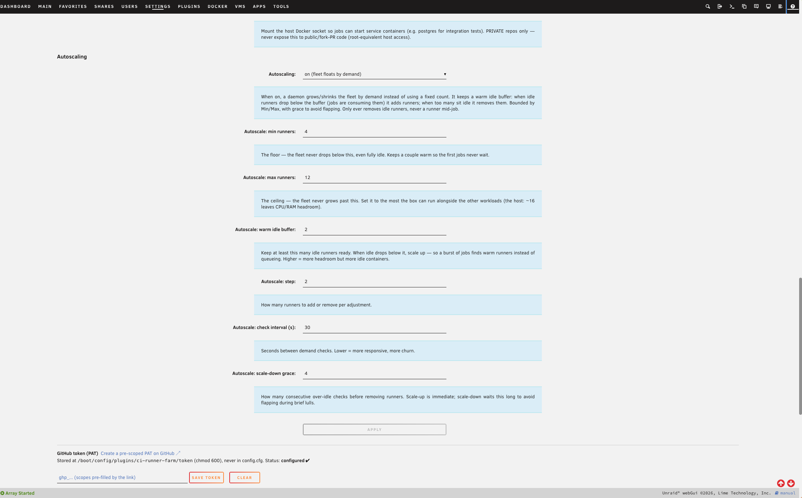
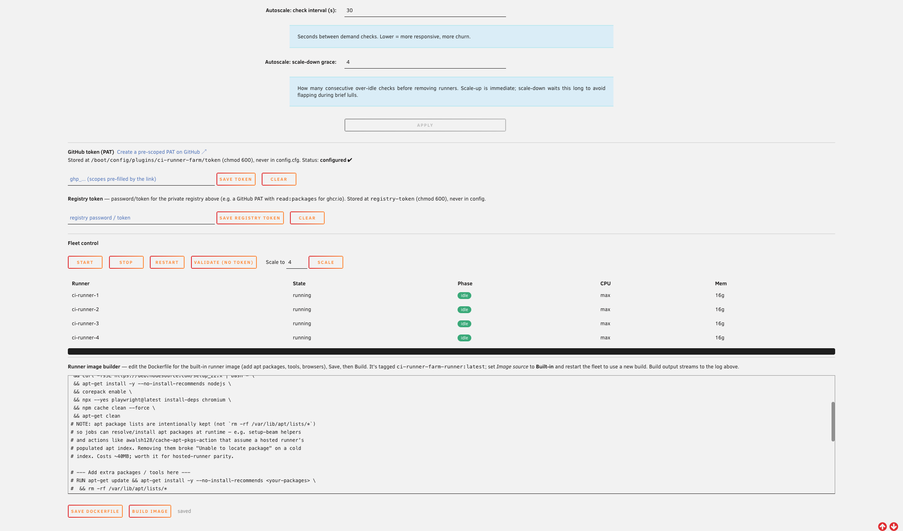

# Turn your Unraid box into a GitHub Actions build farm

**CI Runner Farm** is a one-page Unraid plugin that turns the server you already
own into a fleet of **GitHub Actions self-hosted runners** — multiple
concurrent, resource-capped runners running as Docker containers, with warm
shared caches, queue-aware autoscaling, and Docker-in-Docker. No VM required.
Point it at a repo or org, paste a token, and your builds run on your hardware.

> Drop this whole page into Notion (or a blog CMS) as-is. Images live in
> `./images/` next to this file and are referenced inline. They use *minimal*
> redaction (LAN IP blacked out; the demo hostname "Titan" and host paths are
> still visible) — swap in fully-generic shots before any public press if you'd
> rather not show those.

---

## The pitch (TL;DR)

Hosted CI minutes are **slow and metered**. An Unraid box with spare cores and a
fast cache pool can run many builds in parallel, keep dependency caches hot
between runs, and cost **nothing per minute**.

- **Self-hosted CI on hardware people already own** — a strong cost *and* speed
  story.
- Fits the Unraid "do more with your server" narrative; built for the
  homelab / self-hosting crowd.
- Installs in a couple of clicks via **Community Applications**.
- Everything is driven from a single webGUI page — **no shell required**.

---

## What it actually does

| Capability | What you get |
|---|---|
| **N concurrent runners** | Each runner is its own container, optionally capped with `--cpus` / `--memory` so CI never starves the rest of the host. |
| **Queue-aware autoscaling** | An optional daemon floats the fleet between a min and max based on how many jobs are waiting. |
| **Warm shared caches** | pnpm / npm / yarn / Playwright caches (fully configurable) live on a fast pool and are reused across every run — the biggest hidden win vs. hosted CI re-downloading everything each time. |
| **Docker-in-Docker per runner** | Jobs using `services:` or `docker compose` just work, with an optional shared pull-through registry mirror so images are pulled once for the whole fleet. |
| **Bring your own image** | Use the in-plugin image builder, or point at any image you publish to a registry (public or private). |
| **Web UI** | Configure everything, store the token securely, Start/Stop/Restart/Scale, watch live status, and build your runner image — all from **Settings → Utilities → CI Runner Farm**. |

---

## How it works (architecture in one paragraph)

The plugin provisions a set of Docker containers from a runner image (built
in-plugin or pulled from a registry). Each container registers itself with
GitHub as a self-hosted runner — at **repo** scope or **org** scope (org scope
gives you one shared pool that any private repo can pull from). Persistent
package caches and the build workspace are bind-mounted from a fast pool so they
survive across jobs. An optional companion container runs a **pull-through
registry mirror** so Docker-in-Docker jobs across the whole fleet pull each
image only once. An optional autoscaler polls the GitHub job queue and scales
the fleet up toward your max when work is waiting, then back down to your min
(after a grace period) when it's idle.

---

## Setup, step by step

> Full prerequisites: an Unraid server, a GitHub Personal Access Token, and a
> fast pool/share for caches. Install from **Community Applications** (search
> "CI Runner Farm") or by URL via **Plugins → Install Plugin**:
> `https://github.com/unraid/ci-runner-farm/releases/latest/download/ci-runner-farm.plg`

### 1. Point it at GitHub and size the fleet

Open **Settings → Utilities → CI Runner Farm**. Choose your **scope**
(`repo` or `org`), set the **owner** and **target repos**, an optional **runner
group**, and how many **concurrent runners** to run. Add **runner labels** (so
workflows can target this fleet with `runs-on:`) and optional **CPU / memory
caps per runner** so CI can't starve the rest of the box.

### 2. Choose a runner image, caches, and Docker mode

The **Image source** selector decides where each runner's image comes from:

- **Built-in** (default) — run the image built by the in-plugin **Runner image
  builder**, tagged `ci-runner-farm-runner:latest`. The plugin ships a generic
  starter Dockerfile (stock runner base + a Docker-in-Docker readiness wrapper);
  customize it (add language runtimes, browsers, build tools), **Build**, and
  restart. No registry needed.
- **Remote** — pull a named image, e.g. `ghcr.io/org/ci-runner-image:latest`.
  For a private image, set the registry server + username and save a registry
  token; the host runs `docker login` before provisioning. For `ghcr.io`,
  leaving the registry token blank reuses the GitHub PAT (it must have
  `read:packages`).

Below that, configure the **warm caches** (host-subdir → container-path mounts;
defaults cover pnpm/npm/yarn/Playwright), the **workspace root**, and the
**Docker-in-Docker mode** (per-runner DinD vs. shared socket).

### 3. (Optional) Turn on queue-aware autoscaling

Set a **min** and **max** runner count, a **warm idle buffer**, an **autoscale
step**, a **demand check interval**, and a **scale-down grace** period. The
daemon adds runners when jobs are queued and removes idle ones once the grace
window passes, so you keep capacity ready without leaving the whole fleet
running 24/7.

### 4. Save your token, validate, and start the fleet

Save a GitHub **PAT** (`repo` scope; add `admin:org` for org runners). It's
stored at `/boot/config/plugins/ci-runner-farm/token`, `chmod 600`, and is
**never** written into `config.cfg`. An optional **registry token** is reused
for GHCR login when no separate registry token is set. Then use the **fleet
control** buttons — **Start / Stop / Restart / Scale / Validate** — and watch
live per-runner status (state, phase, CPU, memory). The **Runner image builder**
panel lets you edit the Dockerfile and rebuild right from the page.

### 5. Confirm it's running

Once started, the runners show up as ordinary Docker containers
(`ci-runner-1…N`) plus the optional `ci-runner-mirror` registry mirror — each
with the warm-cache bind mounts you configured. Your runners register with
GitHub and start picking up jobs.

---

## Security (read before exposing the fleet)

Self-hosted runners execute arbitrary workflow code on your hardware.

- DinD runners run `--privileged`, and shared-socket mode gives runners
  root-equivalent access to the host. Use self-hosted runners **only for
  trusted / private repositories**. Fork-PR code from public repos must **never**
  run on a privileged or socket-mounted self-hosted runner.
- For stronger isolation, set `EPHEMERAL=true` so each job gets a clean runner.
- At org scope, create a **runner group restricted to your private repos** so a
  public repo can never schedule onto these runners.

See GitHub's self-hosted runner security guidance for the full picture:
<https://docs.github.com/en/actions/hosting-your-own-runners/managing-self-hosted-runners/about-self-hosted-runners#self-hosted-runner-security>

---

## Install & links

- **Community Applications:** search **CI Runner Farm** and click Install.
- **Install by URL:**
  `https://github.com/unraid/ci-runner-farm/releases/latest/download/ci-runner-farm.plg`
  (Unraid resolves this to the newest published release and keeps it updated.)
- **Source / issues:** <https://github.com/unraid/ci-runner-farm>
- **License:** BSD-2-Clause.

Releases are automated (release-please + GitHub Release assets), so it installs
and updates through Community Applications just like Unraid's other plugins.
